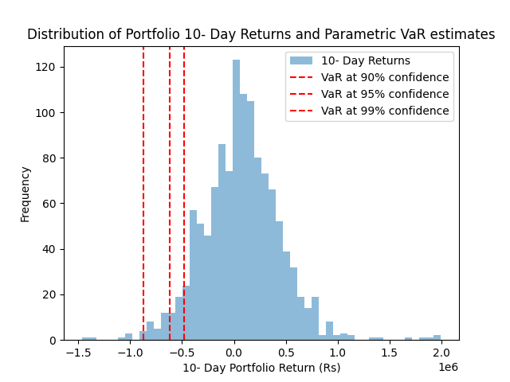

## Value at Risk (VaR) Portfolio Risk Model

This project is a simple implementation of a portfolio risk model using Value at Risk (VaR) parametric method. It uses historical market data and statistical measures to estimate potential losses in a stock portfolio over a fixed time horizon.
 The VaR is a single number that indicates the likehood of losing 'X' percent of capital given a confidence interval and at any given trading session.

## Overview

The project builds an equity portfolio from NSE and evaluates its risk using:

- Historical log returns
- Portfolio variance (covariance matrix)
- Parametric Value at Risk (VaR)
- Multi-day risk scaling
- Visual distribution of returns

It helps simulate how much a portfolio can lose under normal market conditions with a given confidence level.

## How it works 

The calculation of the VaR requires the calculation of the portfolio's standard deviations as a pre-requisite.This method uses statistical approach and follow a normal distribution:

- Calculate mean and standard deviation
- Use Z-score for chosen confidence level
- Calculate VaR using:
  
                    VaR = μ - (Z * σ)

This method assumes that:
- Returns follow a normal distribution  
- Market conditions remain stable  
- Volatility is constant over the period  

---
## Visualisation

The histogram below shows the distribution of portfolio returns. It helps in understanding how returns are distributed around the mean and where potential losses lie.

---
